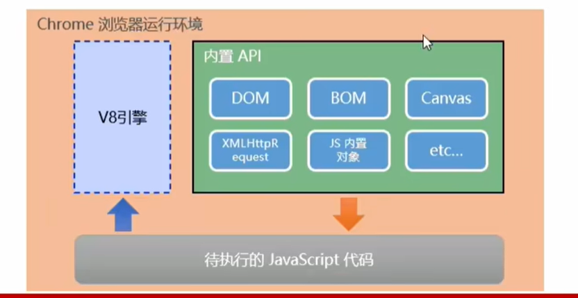

# 初识Node.js
**[node官网](https://nodejs.org/en)**
1. javascript 解析引擎
2. chrome 浏览器用的是V8的解析引擎

3. node.js 也是运行环境 浏览器也是运**行环境 JavaScript是语言 语言的运行需要依赖于运行环境

# node 学习路径
1. node内置API模块（fs、path、http等）
2. 第三方API模块（express、mysql等）

**[下一章](./第二章.md)**